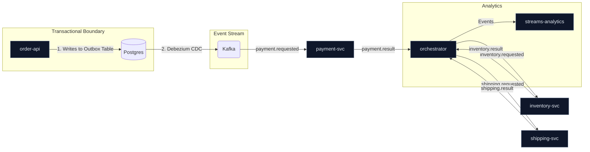

# Chaos Symphony – Outbox EventRouter

[](../../actions)
[](LICENSE)
[](../../issues)


## Overview
A resilient, event-driven microservices project built with **Spring Boot** and **Kafka**. It demonstrates the **Saga and Transactional Outbox patterns** for managing distributed workflows, complete with a built-in chaos injector, deep observability, and a Dead-Letter Queue (DLQ) replay mechanism.

This project isn't just a simple CRUD application; it's an exploration of how to build, operate, and trust a complex, distributed system designed to withstand failure.

## ✨ Key Features

  * **Transactional Outbox Pattern**: Guarantees reliable event publishing using **Debezium** for Change Data Capture (CDC), ensuring no messages are lost.
  * **Saga Orchestration Pattern**: Manages a long-running business transaction (Order → Payment → Inventory → Shipping) across multiple services using a central orchestrator.
  * **Chaos Engineering Injector**: A dedicated service to proactively test system resilience by introducing failures (delays, errors, message drops) at runtime.
  * **Dead-Letter Queue (DLQ) with Replay**: Failed messages are automatically routed to a DLT. A dedicated admin service allows you to inspect and replay these messages via a REST API.
  * **Deep Observability**: A full observability stack with metrics from **Micrometer**, logs, and traces collected by **OpenTelemetry** and visualized in **Prometheus** & **Grafana**.
  * **Real-time Analytics**: A **Kafka Streams** application calculates real-time metrics, such as payment status counts.
  * **Fully Containerized**: The entire infrastructure (8 services, Kafka, PostgreSQL, Grafana, etc.) is managed with a single **Docker Compose** file.

## 🏛️ Architecture

The system uses a central orchestrator to manage the Saga workflow. The `order-api` initiates the process by writing to its local `order_outbox` table. Debezium captures this change and publishes it reliably to Kafka, triggering the first step of the Saga.



## 🛠️ Tech Stack

  * **Backend**: Java 21, Spring Boot 3.4
  * **Messaging**: Apache Kafka, Kafdrop
  * **Database**: PostgreSQL
  * **CDC**: Debezium
  * **Observability**: OpenTelemetry, Prometheus, Grafana
  * **Build**: Maven
  * **Containerization**: Docker

## 🚀 Getting Started

**Prerequisites:** Docker, Java 21, Maven.

The entire system can be started with just three commands:

```bash
# 1. Start the entire infrastructure (Kafka, Postgres, Grafana, etc.)
cd deployment
docker compose up -d

# 2. Build all services
mvn -q -DskipTests install

# 3. Run all Spring Boot applications
mvn -pl orchestrator,payment-svc,inventory-svc,shipping-svc,order-api,streams-analytics,dlq-admin spring-boot:run
```

The system is now running\!

## 🎬 A 5-Minute Demo Tour

Let's see Chaos Symphony in action.

#### Step 1: The Happy Path

Create a new order. This will successfully flow through the entire Saga.

```bash
curl -s -X POST "http://localhost:8080/api/orders/start?amount=42"
```

You can observe the topics in **Kafdrop** (`http://localhost:9000`) to see the events flowing between services.

#### Step 2: Introduce Chaos

Now, let's create an order that is designed to fail at the inventory step. Our Chaos Injector is configured to recognize the `orderId=BREAK-ME`.

```bash
curl -s -X POST "http://localhost:8080/api/orders/start?amount=10&orderId=BREAK-ME"
```

#### Step 3: Observe the Failure

The `inventory-svc` will fail to process the message. After a few retries, it will be moved to the Dead-Letter Topic (`inventory.requested.DLT`).

```bash
# List all topics that have a DLQ
curl -s http://localhost:8089/api/dlq/topics

# Peek at the first 3 messages in the inventory DLT
curl -s "http://localhost:8089/api/dlq/inventory.requested.DLT/peek?n=3"
```

You should see the failed message here.

#### Step 4: Recover from Failure

Let's assume the underlying issue is fixed. We can now replay all messages from the DLT to re-process them.

```bash
curl -X POST http://localhost:8089/api/dlq/inventory.requested.DLT/replay
```

The message will be re-processed, and the Saga will continue from where it left off.

## 📊 Observability Stack

Explore the running system using these tools:

  * **Grafana**: `http://localhost:3000` (admin/admin)
      * *Import the dashboard from `docs/grafana/orders-overview.json` to get started.*
  * **Prometheus**: `http://localhost:9090`
  * **Kafdrop**: `http://localhost:9000`

## ⚙️ Services & Ports

| Service             | Port | Description                                     |
| ------------------- | ---- | ----------------------------------------------- |
| `order-api`         | 8080 | Entrypoint for creating new orders.             |
| `payment-svc`       | 8081 | Processes payment requests.                     |
| `inventory-svc`     | 8084 | Processes inventory allocation requests.        |
| `shipping-svc`      | 8085 | Processes shipping requests.                    |
| `orchestrator`      | 8091 | Manages the Saga state machine.                 |
| `dlq-admin`         | 8089 | REST API for managing Dead-Letter Topics.       |
| `streams-analytics` | 8095 | Kafka Streams application for real-time metrics.|

## 📜 License

This project is licensed under the MIT License. See the [LICENSE](https://www.google.com/search?q=LICENSE) file for details.

## 📚 Advanced Guides & Details

For detailed technical setup and advanced API usage, please refer to the documents below:

* **[PostgreSQL & Debezium Setup Guide](docs/POSTGRES_SETUP.md)**: A complete guide to configuring the database and Change Data Capture.
* **[Advanced API & Postman Guide](docs/API_GUIDE.md)**: Detailed examples for using the Chaos Injector and other service APIs with Postman and cURL.