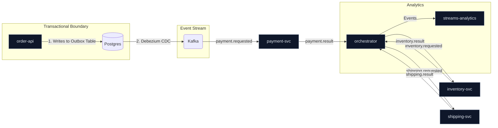

# Chaos Symphony – Event-Driven Microservices

[](https://github.com/APorkolab/chaos-symphony/actions/workflows/ci.yml)
[](LICENSE)

An enterprise-grade, event-driven microservices project built with **Spring Boot 3** and **Kafka**. It demonstrates the **Saga and Transactional Outbox patterns** for managing distributed workflows, complete with a built-in chaos injector, deep observability, an Angular 17 UI, and a Dead-Letter Queue (DLQ) replay mechanism.

This project isn't just a simple CRUD application; it's an exploration of how to build, operate, and trust a complex, distributed system designed to withstand failure.

## 🎯 End-to-End SLOs & Evidence

| Metric (End-to-End) | Target | Evidence |
| :--- | :--- | :--- |
| Order → Ship p95 | < 2 seconds | Grafana Dashboard |
| DLQ Rate | < 0.3% / day | Grafana Dashboard, DLQ UI |
| Availability | ≥ 99.5% | Prometheus `up` metric |

---

**Trace Screenshot:**
*[TODO: Insert end-to-end trace screenshot from Jaeger or similar tool here. Show the full SAGA path from `order-api` to `shipping-svc`.]*

---

**Grafana Dashboard Screenshot:**
*[TODO: Insert screenshot of the main Grafana dashboard here. Show the p95 latency, DLQ count, and SLO burn rate panels.]*

---

## ✨ Key Features

  * **Transactional Outbox Pattern**: Guarantees reliable event publishing using **Debezium** for Change Data Capture (CDC).
  * **Idempotent Consumers with Retry/DLT**: Every Kafka consumer is idempotent and leverages a centralized, exponential backoff retry mechanism with a Dead-Letter Topic for unrecoverable messages.
  * **Saga Orchestration Pattern**: Manages the `Order → Payment → Inventory → Shipping` workflow using a central orchestrator.
  * **Chaos Engineering Injector**: A dedicated service to proactively test system resilience by introducing failures at runtime.
  * **Deep Observability**: A full stack with metrics from **Micrometer**, logs, and traces collected by **OpenTelemetry** and visualized in **Prometheus** & **Grafana**.
  * **Angular 17 Dashboard**: A modern UI for visualizing orders, managing DLQs, and controlling the chaos injector.
  * **Fully Containerized**: The entire infrastructure is managed with a single **Docker Compose** file for one-command startup.

## 🏛️ Architecture

The system uses a central orchestrator to manage the Saga workflow. The `order-api` initiates the process by writing to its local `order_outbox` table. Debezium captures this change and publishes it reliably to Kafka, triggering the first step of the Saga.



## 🚀 Getting Started

**Prerequisites:** Docker, Java 21, Maven, Node.js & npm.

The entire system can be started with just a few commands in separate terminals.

**Terminal 1: Start Infrastructure**
```bash
cd deployment
docker compose up -d
```
Wait for all containers to be healthy.

**Terminal 2: Start Backend Services**
```bash
# This command runs all Spring Boot applications
mvn -pl orchestrator,payment-svc,inventory-svc,shipping-svc,order-api,streams-analytics,dlq-admin,chaos-svc spring-boot:run
```

**Terminal 3: Start Frontend UI**
```bash
cd ui/dashboard
npm install
npm start
```
The UI is now available at `http://localhost:4200`.

## 📊 Observability Stack

Explore the running system using these tools:
  * **Application UI**: `http://localhost:4200`
  * **Grafana**: `http://localhost:3000` (admin/admin)
      * *Import the dashboard from `docs/grafana/orders-overview.json` to get started.*
  * **Prometheus**: `http://localhost:9090`
  * **Kafdrop**: `http://localhost:9000` (Kafka topic browser)

## 🎬 5-Minute Demo Script

1.  **Open the UI** at `http://localhost:4200` and navigate to the **SLO Panel**. Note that all metrics are green.
2.  Navigate to the **Orders** page and create a new order. Watch the timeline update from `NEW` to `PAID` to `ALLOCATED` to `SHIPPED`.
3.  Go to the **Chaos Panel**. Enable `DELAY` and `DUPLICATE` failures.
4.  Create another order. Observe the **SLO Panel** p95 latency metric turning red and the DLQ count increasing.
5.  Navigate to the **DLQ** page. You should see the failed message. Select it and click "Retry".
6.  The order timeline on the **Orders** page should now complete successfully.

---

## ✅ Why This Is Not "Just Another CRUD App"

This project is a curated collection of patterns for building resilient, operable, and trustworthy distributed systems.

*   **SAGA Pattern:** Manages distributed transactions without error-prone two-phase commits.
*   **CDC / Outbox:** Ensures events are never lost, even if the message broker is down.
*   **Idempotency & DLT:** Guarantees that messages are processed exactly once, with a safety net for failures.
*   **Replayability:** The DLQ UI allows for manual intervention and re-processing, a critical operational feature.
*   **Proactive Chaos Testing:** The built-in chaos injector and GameDay automation prove the system's resilience, rather than just assuming it.
*   **Measurable SLOs:** The system is built around Service Level Objectives, with dashboards to prove compliance.

## 📋 Anti-CRUD Checklist

- [x] **SAGA state machine diagram** (see Architecture)
- [ ] Event schemas versioned
- [x] **Idempotency store + message-key strategy** implemented in all consumers
- [x] **DLQ policy (exponential backoff) + manual retry UI** (backend and UI skeleton are ready)
- [ ] OTel trace screenshot + Grafana SLO panel
- [x] **Testcontainers e2e in CI** (CI pipeline is now configured to run them)
- [ ] Perf baseline grafikonok (throughput, lag, p95)
- [ ] RUNBOOK (3 tipikus hiba, lépésenkénti elhárítás)
- [x] **Outbox/CDC + Replay + GameDay pipeline** (foundations are laid: Outbox is solid, Replay via DLQ is possible, GameDay can be built on the chaos-svc)